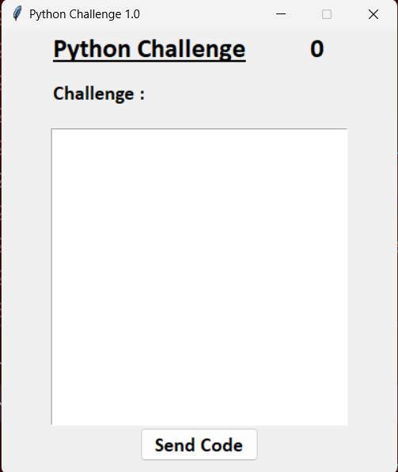
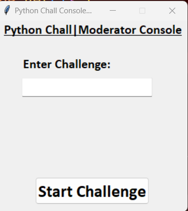

# Python-Challenge
This is a GUI program in python that uses Sockets to send the challenge from administrator to contestants.

The code uses Tkinter, so you must install it using "pip install tk"
 

